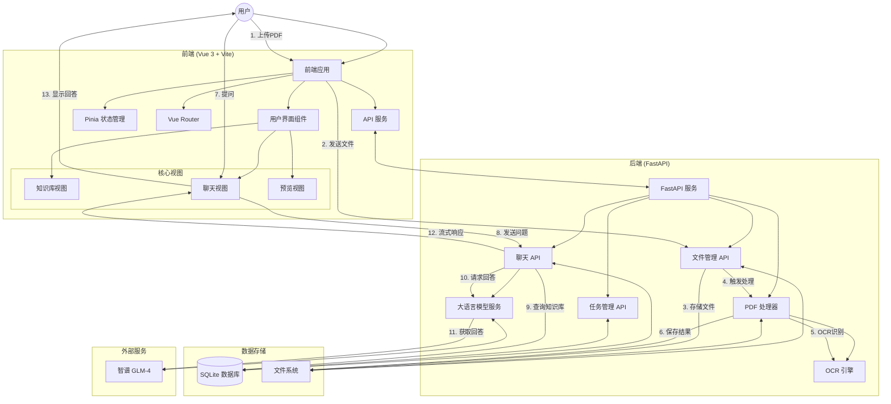

# QAChatAgent - PDF处理与知识库系统

## 项目概述
QAChatAgent 是一个集成了 PDF 处理、知识库管理和智能对话功能的 AI 辅助系统。该项目采用前后端分离架构，通过现代化的 Web 界面提供 PDF 文件处理、Markdown 转换、知识库管理和智能对话等功能。系统旨在提供一站式文档处理和智能问答解决方案，特别适合需要处理大量PDF文档并基于其内容进行智能交互的场景。

## 系统架构

### 架构图


### 系统组件

1. **前端层**
   - **前端应用**：基于Vue 3的单页应用，负责用户界面和交互逻辑
   - **用户界面组件**：包括知识库、聊天和预览等视图
   - **状态管理**：使用Pinia管理应用状态
   - **路由管理**：使用Vue Router处理页面导航
   - **API服务**：封装与后端的通信

2. **后端层**
   - **FastAPI服务**：提供RESTful API服务，处理业务逻辑
   - **文件管理API**：处理文件上传、删除等操作
   - **聊天API**：处理对话请求和响应
   - **任务管理API**：管理异步任务状态
   - **PDF处理器**：解析PDF文件并提取结构化内容
   - **OCR引擎**：识别PDF中的文本内容
   - **大语言模型服务**：与外部AI模型交互

3. **数据存储层**
   - **SQLite数据库**：存储知识库、会话和消息数据
   - **文件系统**：存储上传的文件和处理结果

4. **外部服务层**
   - **智谱GLM-4**：提供智能问答能力

### 通信与数据流
- **前后端通信**：通过HTTP/HTTPS协议进行通信，使用JSON格式交换数据
- **流式响应**：使用SSE (Server-Sent Events)技术实现聊天的流式响应

### 详细数据流程
1. 用户通过前端界面上传PDF文件
2. 前端将文件发送到后端的文件管理API
3. 文件管理API将文件保存到文件系统并触发PDF处理
4. PDF处理器解析PDF文件，使用OCR引擎识别文本
5. 处理结果（Markdown文件、批注PDF等）保存到文件系统
6. 用户在聊天界面提出问题
7. 前端将问题发送到后端的聊天API
8. 聊天API查询知识库中的相关内容
9. 聊天API将问题和相关内容发送给大语言模型服务
10. 大语言模型服务从智谱GLM-4获取回答
11. 聊天API以流式方式将回答返回给前端
12. 前端实时显示回答给用户

## 核心功能

### PDF 处理与转换
- **PDF 文件上传与解析**：支持上传 PDF 文件并进行结构化解析
- **智能内容识别**：使用 OCR 技术识别 PDF 中的文本、表格和图像
- **Markdown 转换**：将 PDF 内容转换为 Markdown 格式，便于后续编辑和使用
- **批注版 PDF 生成**：自动生成带有内容区域标注的 PDF 文件
- **PDF 原文/批注切换**：在预览界面无缝切换原文和批注版本

### 知识库管理
- **知识库创建与删除**：支持创建和管理多个知识库
- **文档上传与预览**：支持上传文档到知识库并提供预览功能
- **文档分类与管理**：对知识库中的文档进行分类和管理
- **默认知识库**：系统提供一个默认知识库，确保基础功能可用

### 智能对话
- **基于知识库的问答**：利用知识库内容进行智能问答
- **会话管理**：支持创建、切换和删除多个对话会话
- **流式响应**：采用 SSE 技术实现流式对话响应
- **上下文记忆**：保持对话上下文，提供连贯的交互体验
- **历史对话感知**：系统能够理解并参考历史对话内容，生成更连贯的回答
- **上下文感知检索**：基于历史对话优化知识库检索，提高回答相关性

## 综合技术栈

### 前端技术
- **核心框架**：Vue 3（组合式API）+ Vite（构建工具）
- **状态管理**：Pinia（Vue状态管理库）
- **路由管理**：Vue Router（Vue官方路由）
- **UI组件库**：Element Plus（基于Vue 3的组件库）
- **样式处理**：Sass/SCSS（CSS预处理器）
- **网络请求**：Axios（基于Promise的HTTP客户端）+ SSE（流式响应）
- **数据持久化**：localStorage（本地存储）

### 后端技术
- **Web框架**：FastAPI（高性能异步Python框架）
- **ASGI服务器**：Uvicorn（ASGI服务器）
- **数据库**：SQLite（默认）+ SQLAlchemy（ORM框架）
- **环境管理**：python-dotenv（环境变量管理）+ Conda（环境隔离）
- **AI框架**：LangChain（大语言模型应用框架）
- **大语言模型**：ChatZhipuAI（智谱GLM-4）

### PDF处理技术
- **PDF解析**：PyMuPDF (fitz)（PDF处理库）
- **文档结构化**：Unstructured（文档结构化工具）
- **OCR引擎**：
  - PaddleOCR（主要OCR引擎，支持中英文）
  - Tesseract（备选OCR引擎）
- **图像处理**：
  - PIL/Pillow（Python图像处理库）
  - Matplotlib（数据可视化）
  - OpenCV（可选，用于高级图像分析）

## 项目结构
```
QAChatAgent/
├── backend/                # 后端代码
│   ├── main.py             # 主 API 服务
│   ├── pdf_to_markdown.py  # PDF 处理核心
│   ├── uploads/            # 文件上传目录
│   ├── chat.db             # SQLite 数据库
│   ├── environment.yml     # Conda 环境配置
│   ├── requirements.txt    # pip 依赖列表
│   └── .env                # 环境变量配置
├── frontend/               # 前端代码
│   ├── public/             # 静态资源
│   └── src/                # 源代码
│       ├── assets/         # 资源文件
│       │   ├── icons/      # SVG图标
│       │   └── theme.css   # 主题配置
│       ├── components/     # 组件
│       │   ├── layout/     # 布局组件
│       │   ├── FilePreview.vue    # 文件预览组件
│       │   └── GlobalPreview.vue  # 全局预览组件
│       ├── router/         # 路由配置
│       ├── services/       # API 服务
│       ├── stores/         # 状态管理
│       │   ├── chat.js     # 聊天状态
│       │   └── knowledge.js # 知识库状态
│       └── views/          # 页面视图
│           ├── chat/       # 聊天相关视图
│           └── knowledge/  # 知识库相关视图
├── start.ps1               # 一键启动脚本
└── README.md               # 项目文档
```

## 快速启动
```powershell
# 克隆项目
git clone https://github.com/SogreyOrg/QAChatAgent.git
cd QAChatAgent

# 启动服务 (需预先安装Python和Node.js)
./start.ps1
```

## 开发指南

### 环境准备
- Python 3.11+
- Node.js 16+
- Poppler (PDF 渲染引擎)
- Tesseract (OCR 引擎)
- SQLite (默认数据库)

### 后端开发
```bash
cd backend
# 使用 Conda 环境（推荐）
conda env create -f environment.yml
conda activate multimodal-rag-pdf
# 或使用 pip
pip install -r requirements.txt -i https://pypi.tuna.tsinghua.edu.cn/simple

# 启动后端服务
python main.py
# 或使用 uvicorn
uvicorn main:app --reload --host 0.0.0.0 --port 8000
```

### 前端开发
```bash
cd frontend
npm install
npm run dev
```

## PDF 处理流程
1. **文件上传**：通过 FastAPI 接口上传 PDF 文件
2. **后台处理**：在后台线程中处理 PDF 文件
3. **内容提取**：使用 LangChain 和 Unstructured 提取 PDF 内容
4. **结构识别**：识别标题、表格、图像等结构化内容
5. **Markdown 转换**：将提取的内容转换为 Markdown 格式
6. **批注生成**：生成带有内容区域标注的 PDF 文件
7. **图像处理**：提取 PDF 中的图像并保存到指定目录

## 系统特色

### 现代化用户界面
- **科技感设计**：使用蓝紫色渐变增强科技感
- **微妙动画**：按钮和交互元素添加细微动画效果
- **网格背景**：聊天和知识库界面使用网格背景增强深度感
- **响应式布局**：适应不同设备和屏幕尺寸

### 高效文档处理
- **多语言OCR**：支持中英文混合识别
- **表格结构保留**：自动识别表格结构并保留格式
- **批量处理**：支持多文件上传和批量处理
- **异步任务**：大型文件使用后台异步处理，不阻塞用户操作

### 智能交互体验
- **流式响应**：聊天回复实时流式显示，提供即时反馈
- **上下文感知**：系统记住对话历史，提供连贯的交互体验
- **知识库切换**：可在不同知识库间无缝切换，满足不同场景需求
- **会话管理**：支持多会话并行，便于处理不同主题的问答

## API接口概览

### 文件管理接口
- **POST /api/upload** - 上传文件
- **DELETE /api/delete/{filename}** - 删除文件
- **GET /api/task/status/{task_id}** - 查询任务状态

### 聊天接口
- **GET /api/chat/stream** - 流式聊天响应

## 常见问题

### 1. PDF 处理失败？
- 确保 Poppler 和 Tesseract 正确安装并配置
- 检查 PDF 文件是否损坏或加密
- 对于大型 PDF，可能需要增加处理超时时间

### 2. 删除文件失败？
- 检查后端服务是否正常运行
- 确认文件权限设置正确
- 检查文件是否被其他程序占用

### 3. 前端无法连接后端？
- 确认后端服务已启动并监听正确端口
- 检查网络连接和防火墙设置
- 验证 API 路径配置是否正确

## 最近更新
- **流式聊天历史上下文功能**：改进聊天功能，支持历史对话上下文感知，提供更连贯的交互体验
- **PDF 原文/批注切换功能**：在预览界面添加原文和批注版本切换按钮
- **文件排序优化**：按上传时间倒序排列文件
- **UI 优化**：改进文件预览和知识库管理界面
- **性能优化**：提升 PDF 处理速度和稳定性
- **Element Plus组件解析错误修复**：解决全局预览组件中的组件解析问题
- **Vue Router警告修复**：修复路由配置中的命名冲突
- **SQLAlchemy条件比较修复**：解决数据库查询中的类型比较问题

## 未来规划
- **多语言支持**：增加英语、日语等多语言界面
- **高级搜索**：实现知识库内容的高级搜索功能
- **用户权限管理**：添加多用户支持和权限控制
- **云端同步**：支持知识库和会话的云端备份与同步
- **更多文件格式**：扩展对Word、Excel等更多文件格式的支持