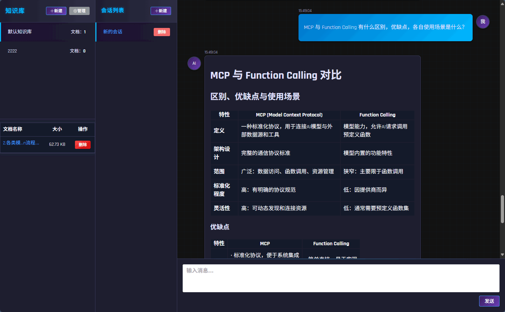
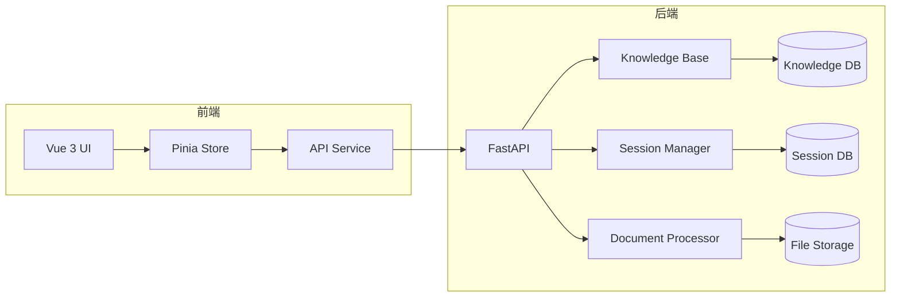
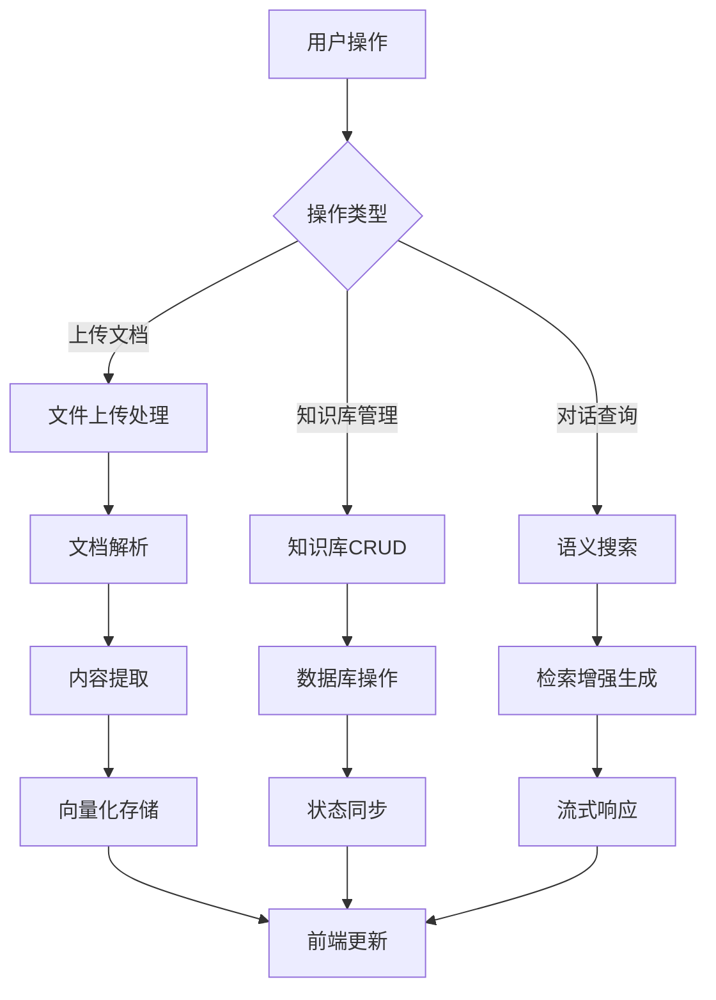
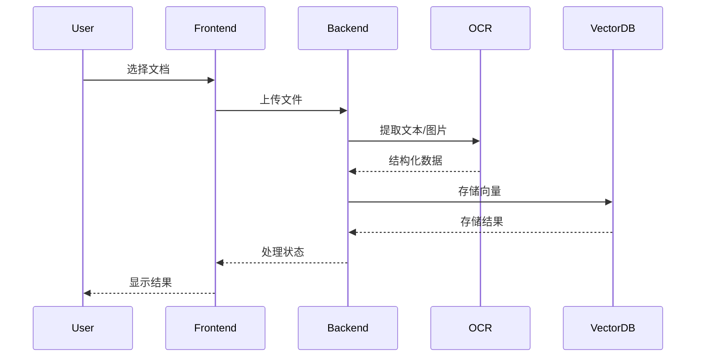
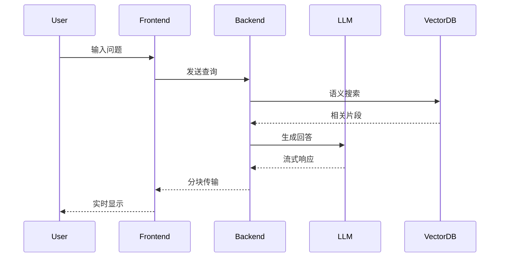

# QAChatAgent - 智能问答系统

## 项目概述

QAChatAgent 是一个基于 AI 的智能问答系统，提供 PDF 文档处理和基于知识库的智能对话功能。系统分为前端和后端两部分，支持多会话管理和上下文感知的智能问答。最新版本增强了多会话管理功能和知识库检索能力。



## 主要功能

### 后端功能
- PDF 文档解析与结构化提取
- 多语言 OCR 识别
- 表格结构自动识别
- 图片提取与保存
- 基于知识库的智能问答
- 多会话管理
- 上下文感知检索
- 智能问题重构
- 历史对话感知

### 前端功能
- 响应式聊天界面
- 多会话切换与管理
- 消息历史记录
- 文件上传与处理状态显示
- 流式对话响应 (支持JSON格式消息解析)
- 自动滚动到最新消息
- 科技感UI设计
- 会话状态持久化
- 健壮的消息传输处理 (支持换行符、特殊字符)
- SSE连接可靠性保障 (自动重连、超时处理)

## 技术栈

### 后端
- Python 3.11+
- FastAPI
- SQLAlchemy
- PyMuPDF
- PaddleOCR
- ChatZhipuAI (GLM-4)

### 前端
- Vue 3
- Pinia
- Element Plus
- Axios
- EventSource (SSE)
- JSON序列化/反序列化

## 系统架构总览



## 核心模块管理

| 模块类型       | 组件                | 技术栈               | 主要功能                     |
|----------------|---------------------|----------------------|----------------------------|
| **前端模块**   | UI框架              | Vue 3 + Element Plus | 用户界面渲染与交互          |
|                | 状态管理            | Pinia                | 应用状态集中管理            |
|                | API通信             | Axios                | 前后端数据交互              |
| **后端模块**   | API服务             | FastAPI              | RESTful接口提供             |
|                | 知识库管理          | SQLAlchemy           | 知识库CRUD操作              |
|                | 文档处理            | PyMuPDF + PaddleOCR  | 文档解析与内容提取          |
|                | 向量搜索            | ChromaDB             | 语义搜索与相似度计算        |
| **数据存储**   | 知识库存储          | SQLite/PostgreSQL    | 知识库元数据存储            |
|                | 会话历史            | SQLite               | 聊天记录持久化              |
|                | 文件存储            | 本地文件系统         | 上传文档存储                |

## 完整执行流程图



## 关键时序图

### 文档上传处理时序



### 智能问答时序



## 快速开始

1. 克隆仓库：
```bash
git clone https://github.com/SogreyOrg/QAChatAgent.git
cd QAChatAgent
```

2. 启动后端服务：
```bash
cd backend
pip install -r requirements.txt -i https://pypi.tuna.tsinghua.edu.cn/simple
python main.py
```

3. 启动前端开发服务器：
```bash
cd frontend
npm install
npm run dev
```

## 项目结构

```
QAChatAgent/
├── backend/          # 后端服务
├── frontend/         # 前端应用
├── docs/             # 项目文档
├── CHANGELOG.md      # 版本变更记录
└── README.md         # 项目主文档
```

## 贡献指南

欢迎提交 Pull Request。对于重大变更，请先开 Issue 讨论。

## 最新优化

### 流式Markdown渲染 (2025/9/21)
1. 前端实现流式Markdown消息渲染
2. 添加marked和DOMPurify依赖
3. 改进消息内容解析和显示方式

### 消息传输优化 (2025/9/21)
1. **后端改造**：
   - 标准化JSON格式流式响应
   - 确保特殊字符和换行符正确编码
   - 示例代码：
     ```python
     yield f"data: {json.dumps({'content': content})}"
     ```

2. **前端增强**：
   - 健壮的JSON解析 (支持多JSON对象连接)
   - SSE连接可靠性 (状态检查、超时处理)
   - 消息显示优化 (保留换行符)
   - 示例代码：
     ```javascript
     const jsonPattern = /{[^}]+}/g
     const jsonMatches = event.data.match(jsonPattern)
     ```

3. **调试技巧**：
   - 分层日志系统 (连接/消息/错误)
   - 浏览器Network面板监控
   - Sources面板断点调试

## 许可证

MIT License